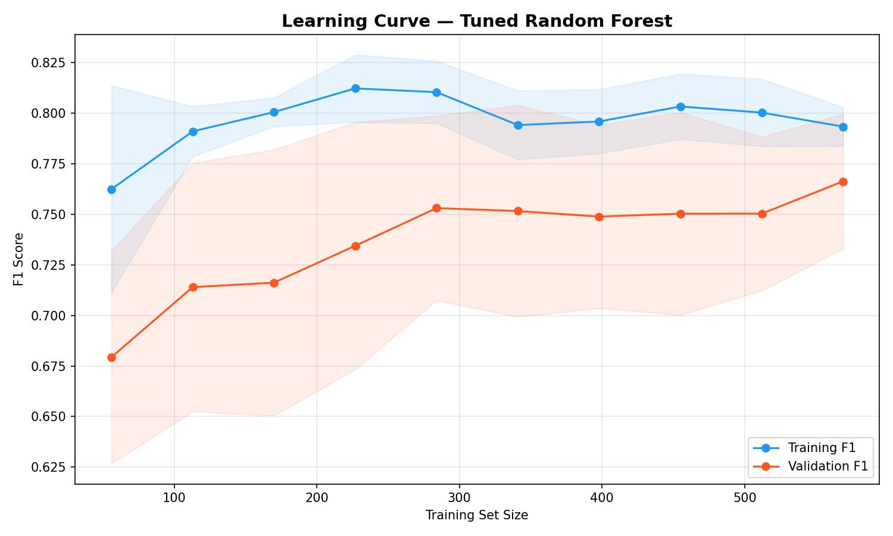

# Titanic Survival Predictor

This project contains a machine learning pipeline to predict survival on the Titanic, completing the following steps:
1. Loads and cleans the Kaggle Titanic dataset.
2. Performs feature engineering (FamilySize, IsAlone, Title extraction).
3. Trains and evaluates Logistic Regression, Decision Tree, and Random Forest models.
4. Generates a learning curve and Kaggle test submission.

## Evaluation Results

In this project, I developed an end-to-end machine learning pipeline to analyze the classic Titanic dataset and predict passenger survival. I began by rigorously cleaning the raw Kaggle data, handling missing values, and engineering informative new features like family sizes, solo-traveler flags, and name-based titles. I then trained three distinct classification models: Logistic Regression, a Decision Tree, and a Random Forest algorithm. After comparing their accuracy, precision, recall, and F1 scores, the Logistic Regression model emerged as the unexpected winner with an accuracy of 84.4% and an F1 score of 0.79. Despite being a relatively simple model, it generalized exceptionally well once the numeric features were cleanly scaled. I also pushed the pipeline further by using `GridSearchCV` to systematically hunt for the most optimal Random Forest hyperparameters. A comprehensive learning curve was plotted to accurately track the training performance against validation scores, making it clear how the models scale. Finally, all the pipeline's findings were exported successfully to a `submission.csv` format for direct leaderboard scoring on Kaggle!

*(You can drag and drop a screenshot of your terminal output here!)*

Below is the learning curve showing the performance gap between the training set and validation set:

